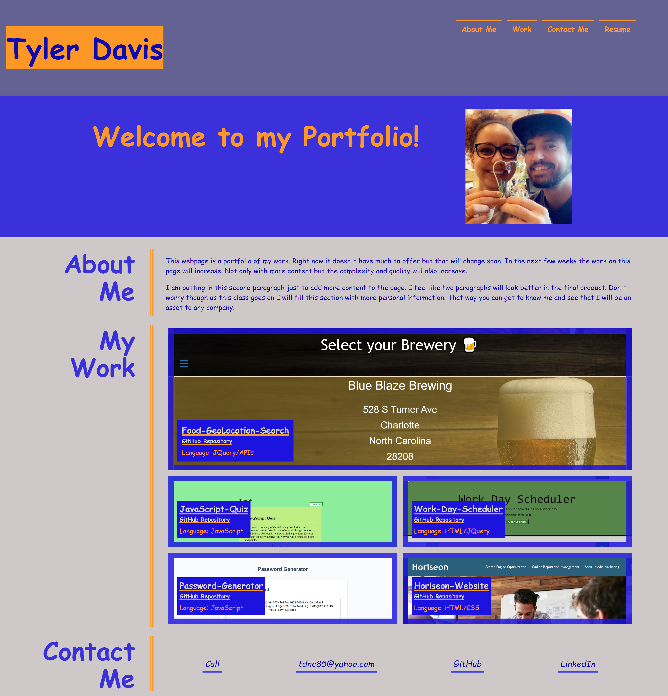

# My-Portfolio

## Description
This week for homework we were asked to create a portfolio website.  This website will display examples of our work to show future employers that we are a good candidate for an open position.

## Installation
* The first thing I did was create a repository named My-Portfolio with Github and clone it
* Next I opened My-Portfolio with VS Code and created index.html and styles.css files as well as making a folder for images
* After that I made an HTML page with the information for my portfolio page
* Once I had the HTML page complete I started making the CSS file to style my page
* With the CSS file I styled flexboxes, set background colors, and changed font size, color, family, etc
* Once I had the boxes and navigation bar where I wanted them I started on animation and linking the navigation bar to take the user to the appropriate section when clicked
* When the animation was complete I added background images to the boxes in the "My Work" section
* When that was done I went through the HTML and CSS pages and tweaked some things to get everything exactly the way I wanted them to look
* Once I had it looking how I wanted I used @media selectors to change the page layout based on screen size to accommodate tablets and cell phones
* After that I linked some of my work to the "My Work" section and added links for my phone number, email, Github and LinkedIn in the "Contact Me" section

## Technologies Used
* HTML
* CSS
* Git Bash
* GitHub

## Author
  Tyler Davis &nbsp; | &nbsp; [GitHub](https://github.com/Twdavis85)

## Review URL
[GitHub](https://github.com/Twdavis85/My-Portfolio) &nbsp; | &nbsp; 
[Live](https://twdavis85.github.io/My-Portfolio/)

#

## License
Copyright 2021 &ensp; Tyler Davis

    Permission is hereby granted, free of charge, to any person obtaining a copy of this software and associated documentation files (the "Software"), to deal in the Software without restriction, including without limitation the rights to use, copy, modify, merge, publish, distribute, sublicense, and/or sell copies of the Software, and to permit persons to whom the Software is furnished to do so, subject to the following conditions:
    
    The above copyright notice and this permission notice shall be included in all copies or substantial portions of the Software.
    
    THE SOFTWARE IS PROVIDED "AS IS", WITHOUT WARRANTY OF ANY KIND, EXPRESS OR IMPLIED, INCLUDING BUT NOT LIMITED TO THE WARRANTIES OF MERCHANTABILITY, FITNESS FOR A PARTICULAR PURPOSE AND NONINFRINGEMENT. IN NO EVENT SHALL THE AUTHORS OR COPYRIGHT HOLDERS BE LIABLE FOR ANY CLAIM, DAMAGES OR OTHER LIABILITY, WHETHER IN AN ACTION OF CONTRACT, TORT OR OTHERWISE, ARISING FROM, OUT OF OR IN CONNECTION WITH THE SOFTWARE OR THE USE OR OTHER DEALINGS IN THE SOFTWARE.
